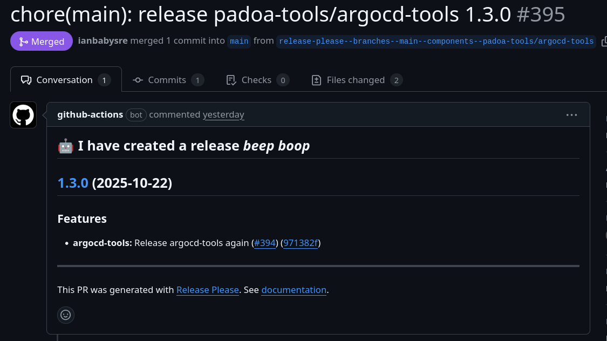
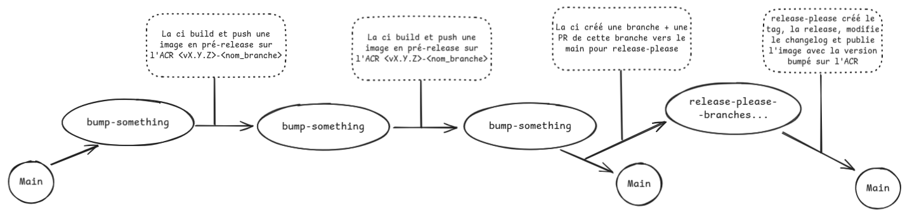
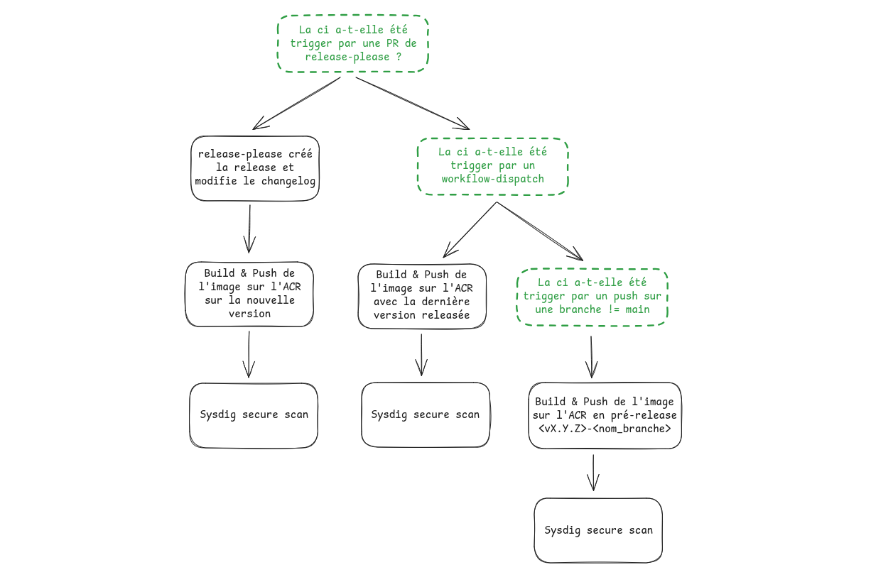

# Monorepo des images de Padoa

## Architecture du repo
Le repo est constituté comme suit : 
```bash
.
├── .git/
├── .github
│   ├── actions
│   │   └── build_push_image
│   │       └── action.yml          # La ci en elle même, qui build-push les images Docker et créé release et tags GitHub
│   └── workflows
│       ├── argocd.yml              # Chaque image possède son propre workflow (pour définir ses propres inputs) et appelle l'action build_push_image/action.yml
│       ├── ...
│       └── ...
├── .gitignore
├── images                          # Dossier contenant tous les dossiers d'images
│   ├── argocd                      # Dossier contenant l'image de argocd
│   │   ├── Dockerfile
│   │   ├── .release-please-config.json     # Config la config pour la github-action
│   │   └── .release-please-manifest.json   # Contient la version de l'image
│   ├── ...
│   └── ...
└── README
```

## Ajouter une nouvelle image
Pour ajouter une nouvelle image : 

### 1. Créer le dossier de l'image

**IMPORTANT : Le chemin du dossier doit correspondre au chemin souhaité dans l'ACR.**

Les images sont organisées par catégorie :
* `padoa-tools/` : Pour les outils et images génériques
* `medical/` : Pour les images spécifiques au domaine médical
* `padoa/` : Pour les images Padoa spécifiques

Exemple : Si vous voulez que votre image soit `padoa-tools/mon-outil` dans l'ACR, créez le dossier `padoa-tools/mon-outil/`

### 2. Créer un workflow dans .github/workflows/

#### a. Définir les trigger de workflow et lui donner les droits pour permettre à release-please de tourner correctement
```yaml
on:
  workflow_dispatch:
  pull_request:
    branches:
      - main   #  Permet de build, push et créer une release suite au merge d'une PR de release-please
    paths:
      - 'padoa-tools/mon-outil/**'  # Permet de tester un build de l'image (sans push dans le registry) en ci à chaque modification
      - '.github/workflows/mon-outil.yml'
  push:
    paths:
      - 'padoa-tools/mon-outil/**'  # Permet de build/push une pré-release de l'image
      - '.github/workflows/mon-outil.yml'

permissions:
  contents: write
  pull-requests: write
```

#### b. Définir le job et les inputs
```yaml
jobs:
  build-push:
    defaults:
      run:
        working-directory: padoa-tools/mon-outil  # Doit correspondre au chemin de l'image
    runs-on: ubuntu-latest
    steps:
      - name: Checkout
        uses: actions/checkout@v4.1.1
      - name: build and push
        uses: ./.github/actions/build_push_image
        with:
          acr-host: ${{ secrets.ACR_HOST }}
          acr-push-user: ${{ secrets.ACR_PUSH_USER }}
          acr-push-password: ${{ secrets.ACR_PUSH_PASSWORD }}
          azdo-pull-token: ${{ secrets.AZDO_NPM_REGISTRY_PULL_TOKEN }}
          github-token: ${{ secrets.GITHUB_TOKEN }}
```

**Note :** Le `working-directory` est crucial car l'action l'utilise pour :
- Localiser le Dockerfile
- Identifier l'image dans release-please

De nombreux inputs sont possibles pour les workflows. Les inputs obligatoires pour l'action `./.github/actions/build_push_image` sont les suivants : 
* acr-host: ${{ secrets.ACR_HOST }}
* acr-push-user: ${{ secrets.ACR_PUSH_USER }}
* acr-push-password: ${{ secrets.ACR_PUSH_PASSWORD }}
* azdo-pull-token: ${{ secrets.AZDO_NPM_REGISTRY_PULL_TOKEN }}
* github-token: ${{ secrets.GITHUB_TOKEN }}

_Pour les autres inputs optionnels (platforms, base-tag, should-tag-latest, etc.), se référer à `.github/actions/build_push_image/action.yml`_

### 3. Cas particulier : les images build plusieurs fois avec la même deps, mais sous différentes versions
Dans le cas précis des images build plusieurs fois avec la même deps, mais sous différentes versions (e.g. node-outatime qui est build avec node 24.6.0, 20.19.4, 20.19.0, 20.8.0, 18.18.0, 18.15.0, 16.20.0), il faut alors inclure la dépendance qui varie dans le nom de l'image au format `-dependancevX.Y` lors de la création
Ainsi, pour node-outatime, on aurait 
* padoa-tools/outatime-node-**nodev24.6**
* padoa-tools/outatime-node-**nodev20.19**
* padoa-tools/outatime-node-**nodev20.16**
...
Ensuite, l'image fera son versioning automatiquement, au fil du dev grâce à release-please

[(cf. Quelques mots sur le versioning)](#quelques-mots-sur-le-nom-et-versioning-des-images) pour plus de détails.


### 3. Ajouter l'image à la configuration release-please globale

**Les fichiers release-please sont maintenant centralisés à la racine du projet.**

Il faut ajouter votre nouvelle image dans les 2 fichiers à la racine :

#### `.release-please-manifest.json` (à la racine)
Ajouter une entrée avec le chemin de l'image et sa version initiale :
```json
{
  "padoa-tools/mon-outil": "1.0.0",
  // ... autres images
}
```

#### `.release-please-config.json` (à la racine)
Ajouter une entrée dans la section `packages` :
```json
{
  "$schema": "https://raw.githubusercontent.com/googleapis/release-please/main/schemas/config.json",
  "include-v-in-tag": true,
  "skip-labeling": true,
  "packages": {
    "padoa-tools/mon-outil": {
      "package-name": "padoa-tools/mon-outil",
      "release-type": "simple"
    },
    // ... autres images
  },
  "changelog-sections": [
    { "type": "feat", "section": "Features" },
    { "type": "fix", "section": "Bug Fixes" },
    { "type": "chore", "section": "Miscellaneous" }
  ]
}
```

**Important :** Le chemin dans ces fichiers doit correspondre exactement au chemin du dossier de l'image.

Pour tout autre ajustement dans la config de release-please pour une image, je vous laisse vous référer à la doc sur le [config file](https://github.com/googleapis/release-please/blob/main/docs/manifest-releaser.md#configfile)

### 4. Et ensuite ?

Dorénavant, lorsque vous travaillerez sur une image, release-please ouvrira une PR qui référencera tous les commits apportés sur l'image. Quand vous aurez fini, vous pouvez merge la PR, et release-please (et la ci) se chargera de 
* Calculer le bump et mettre à jour `.release-please-manifest.json` (à la racine)
* Générer un changelog dans le dossier de l'image
* Créer une release GitHub
* Build et Push l'image sur l'ACR

_Exemple d'une PR de release-please à merge :_


## **ATTENTION : Si vous ne mergez pas la PR ouverte par release please, la release ne sera pas créé, et l'image taggé ne sera pas push sur la registry**

Ensuite, concernant le calcul du bump sur une vX.Y.Z: 
* Si au moins un commit contient `feat!`/`fix!`/`refactor!` -> La majeur X augmente de 1
  * **Attention, release-please ne considère pas les commits de type `BREAKING CHANGE:`** (un indicteur qu'on utilise souvent en commit pour demander un bump de majeur)
* Si au moins un commit contient `feat` -> La mineur Y augmente de 1
* Si au moins un commit contient `fix` -> Le patch Z augmente de 1

_La présence d'une modification majeure annule la présence d'une mineure, idem pour une mineur et un patch_

## Flow de dev conseillé



## Fonctionnement de la ci



## Quelques mots sur le nom et versioning des images

Afin de donner des guidelines sur le versioning des images, une [RFC a été rédigée](https://www.notion.so/padoa/RFC-Container-Images-2694976cdfac800997e6cd12deb5d555).
L'idée est de trouver pour chaque image un compromis entre : donner suffisament d'informations pour pouvoir différencier les versions, sans pour autant qu'un bump de version devienne un toil à roll.

TLDR de la RFC : 
1. Dans la grande majorité des cas, release-please va faire le travaille tout seul de tagger l'image en fonction des modifications apportées.
2. Dans le cas particuliers des images build plusieurs fois avec une deps qui change de version (e.g. node-outatime), alors on incut le nom et la version de cette dépendance dans le nom de l'image au format `-dependancevX.Y` lors de la création
  a. Avec node-outatime qui utilise node 24.6.0, 20.19.0 ... on aurait padoa-tools/outatime-node-**nodev24.6**, padoa-tools/outatime-node-**nodev20.19**
  b. Ensuite, on laisse release-please faire le versioning des tags de cette image en fonction des commits

## FAQ

### Comment release-please fonctionne ?

Release-please va utiliser le fichier de config `.release-please-config` pour connaître la liste de toutes les images qu'il doit surveiller.

Lors du trigger de la ci, il va regarder parmis ces dossiers, lesquels ont été modifiés par quels commits, calculer le bump de version pour chacune des images en fonction ds mots-clés dans les commit, puis créé / update une PR qui référence tous les commits et calcule une prévision du dump.

Lorsque l'on merge cette PR, la GitHub Action release-please détecte que c'est une des ces PR qui a trigger la CI.
A ce moment, elle 
* Modifie le changelog des images
* Màj son .release-please-manifest.json avec la version
* Créé une release + tag GitHub
* Donne des outputs, notamment 
  * `outputs.release_created` = true : si cette ci a été trigger par une PR de release-please
  * `outputs.version` : nouvelle version calculée

On utilise ensuite ces outputs pour savoir si on essaye juste de build, ou si il s'agit d'une version à release, build-push, secure-scan

Pour plus d'info : [Release-Please-Action](https://github.com/googleapis/release-please-action?tab=readme-ov-file#advanced-release-configuration)

### Choix conceptuels 
* De nombreux autres gh actions proposent de gérer le versioning, mais release-please semble être le plus adapté pour des **monorepo** avec des images **Docker, et non package node**
* Garder un workflow séparé pour chaque image est une bonne idée pour ne déclencher la ci sur certaines images, que lorsque les pushs modifient certains paths
* Il aurait été sympa de pouvoir se contenter d'un seul fichier de config et manifest globaux, mais cette configuration fait que lors du run de release-please, il annalyse et bump toutes les images dans son fichier de config. Pour cette raison un fichier de config a été créé dans chaque dossier d'image.
* Le champ path de release-please ne fonctionne en réalité que en mode simple-release, donc sans manifest ni config. Cela implique que le nom de la release correspond au path sur GitHub, ce qui n'est pas souhaité
